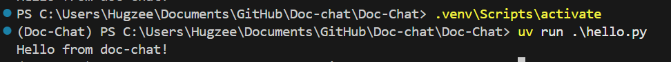

#                                    ✨  Doc-Chat ✨

 

Doc-chat is repository for you to chat and learn an information in a wesite or link of your choice and extract insights from it.

The contents could be
- ⚡ A web documentation that youa are curious about.
- 📫 A pdf book online,
- ⚡ A recently released publication.

If it is available to crawl, you have it! The Doc-chat is ready to consume any knowledge that you present and would act as your study buddy!

# Setup

For Windows 
Install uv for python package management from https://docs.astral.sh/uv/getting-started/installation/
- $ curl -LsSf https://astral.sh/uv/install.sh | less
or 
- $ pip install uv

# Python package
The pyproject.toml contains metadata about the project. The following command will create a pyproject.toml file.
- $ uv init

To create a virtual environment at .venv
- $ uv venv

The virtual environment can be "activated" to make its packages available
In Terminal
- $ source .venv/bin/activate
In powershell
- $ .venv\Scripts\activate

# Install packages
uv.lock is a human-readable TOML file but is managed by uv and should not be edited manually.
- $ uv run .\hello.py

# Set up OPENAI key
Add the key in ".env-sample" file in the path "./bot" abd rename the file name to ".env".

# Create a Crawler
- $ scrapy startproject DocCrawl 
- $ cd DocCrawl 
- $ scrapy genspider document_spider document_spider.co

Now edit the spider as per use and start crawling
- $ scrapy crawl document_spider

With this, the crawled document would be available in "./scraped_files" path as text files.
For the time being, We consider only one scraped file for next step.

# Create a vector DB Storage
- $ cd .\VectorDB\
- $ uv run .\create_vector_store.py

With this step based on the length of the document, chromadb collections are created in "./vectorstore" path.

# Power up the bot
- $ cd ..
- $ uv run streamlit run app.py

A link will open up in the browser with url : http://localhost:8501/ 

There you go!
