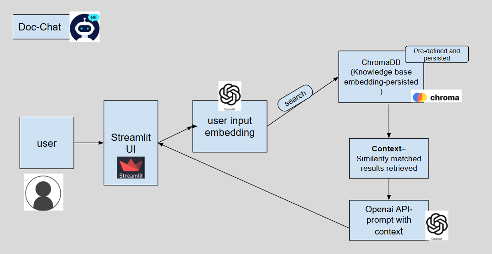
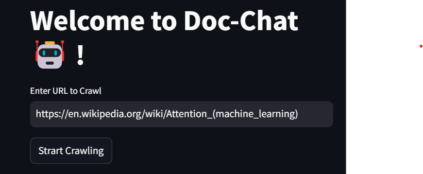
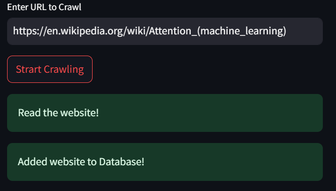

#                                    ✨  Doc-Chat ✨

[](https://github.com/thatgirlfrommoon/Doc-Chat/stargazers)
[](https://github.com/thatgirlfrommoon/Doc-Chat/forks)
[](https://opensource.org/license/apache-2-0)
[](https://www.python.org/downloads/)
[](https://colab.research.google.com/drive/1yrS2Kp-kprYWot_sEu7JeWMIRAei_vov?usp=sharing)
[](https://python.langchain.com/docs/introduction/)
[](https://streamlit.io/)


Doc-Chat is a repository for you to chat and extract insights from any website or document of your choice.

Possible Use Cases:
- ⚡ A web documentation that you are curious about.
- 📫 A pdf book online.
- ⚡ A recently released publication

If it's accessible to crawl, it's yours! The Doc-chat is ready to absorb any knowledge you provide and will serve as your trusty study companion!

# What is Doc-Chat?




##  Get started

1. **Clone the repository**

    - ``` bash
        https://github.com/thatgirlfrommoon/Doc-Chat.git 
        ```

    Or start a codespace from the repository.
    - ```bash
      https://codespaces.new/thatgirlfrommoon/Doc-Chat
      ```
2. **Install uv**

    MacOS/Linux:

    - ```bash
      curl -LsSf https://astral.sh/uv/install.sh | s
      ```

        
    Windows:

    - ```bash 
      powershell -ExecutionPolicy ByPass -c "irm https://astral.sh/uv/install.ps1 | iex"```
      
Make sure to restart your terminal afterwards to ensure that the uv command gets picked up.
    
3. **Install Dependencies** 📦
    ```bash
    uv sync
    ```

4. **Set up OPENAI key**
Add the key in ".env-sample" files in two paths paths 
   - main folder
   - ".\vector_db\env-sample"

    and rename both files to ".env".

5. **Now start crawling.**

    Enter a valid url to crawl and press enter to see a new button "Start crawling". Start crawling to add the URL content to knowledge base.

      

    Wait for few seconds to process. Try URL:

- https://huggingface.co/docs/transformers/en/index


6. **Vector DB storage**

    Once the text files are saved locally, we store the embedded data of the same in a vector_db persisted at:

- ```bash
  .\vector_db\vector_store\
    ```
    
    
    

 Once this step is completed, you will see a notification in the screen "Added website to Database!". 
 
 A dropdown in the left panel will be updated with new URL you just added. Now you are ready to Chat with Doc-Chat with new information added.

7. **Power up the bot**

- ```bash
  uv run streamlit run app.py
  ```


A link will open up in the browser with url : http://localhost:8501/ (or similar)

There you go!
